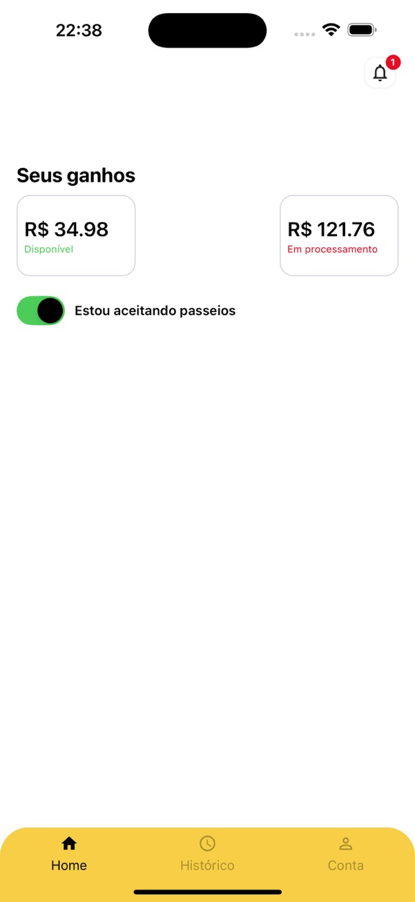
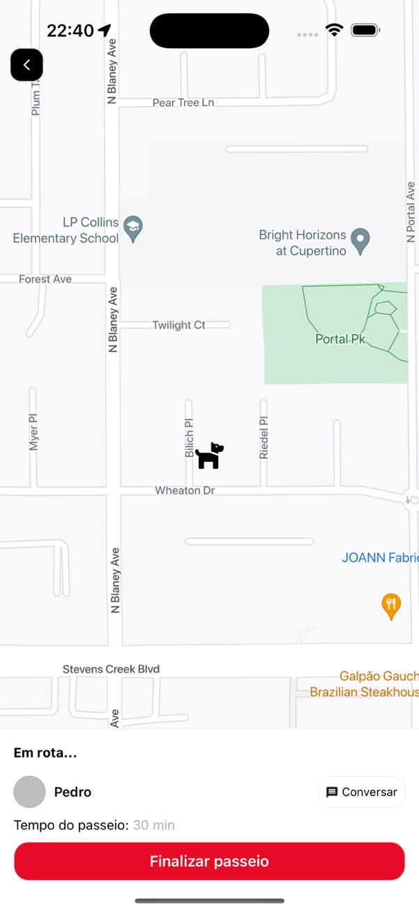
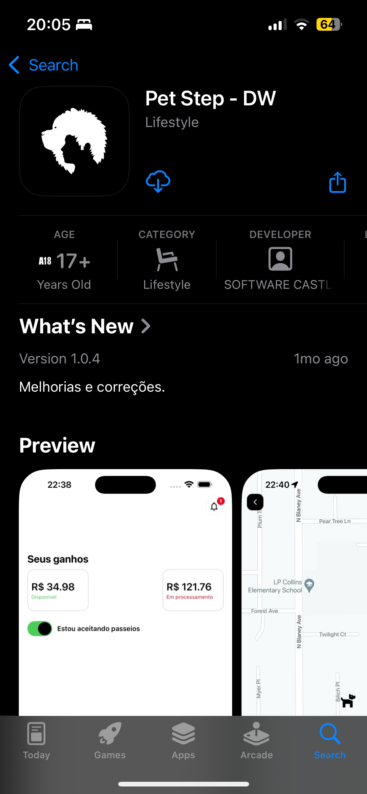

# Pet Step - Dog Walker App

## About the Project

**Pet Step - Dog Walker App** was a personal project designed to connect dog walkers with pet owners in need of reliable walking services. This app, as part of the **Pet Step** platform, allowed dog walkers to manage walk requests, communicate with pet owners, and track walks in real-time.

Built using **React Native**, the app was designed to work seamlessly on both Android and iOS. Though no longer in production, it has been open-sourced to serve as a reference and learning resource.

---

## Technologies Used

### Frameworks and Tools

- **React Native**: Cross-platform development for iOS and Android.
- **TypeScript**: Strongly-typed JavaScript for robust development.
- **Context API**: State management.
- **NativeWind**: For styling components.
- **Firebase Cloud Messaging (FCM)**: Push notifications for real-time updates.
- **Firebase Realtime Database**: Managed real-time chat between dog walkers and pet owners.
- **Stripe SDK**: Payment integration to receive payouts.

### Backend Integration

The app connected to the [Pet Step Backend](https://github.com/PdroHenriqueDev/pet-step-server), which handled:

- Authentication and user management.
- Payment processing with Stripe.
- Notifications via Firebase.
- Real-time tracking of walks.
- Secure chat powered by **Firebase Realtime Database**.

---

## Features

### For Dog Walkers

- **Sign-Up and Login**: Secure authentication using email and password.
- **Walk Management**: Accept or decline walk requests from nearby pet owners.
- **Real-Time Tracking**: Share your location with pet owners during walks.
- **Chat**: Communicate with pet owners in real-time, powered by Firebase Realtime Database.
- **Ratings**: View feedback from pet owners and improve your service quality.
- **Payout Management**: Receive payments directly through Stripe.

### Notifications

- **Push Notifications**: Get alerts for new walk request and chat messages.

---

## Prerequisites

Before setting up the app, ensure you have the following:

- **Node.js** (version 16 or higher)
- **Android Studio** or **Xcode** (for emulator or device testing)
- **Firebase Account** (to set up push notifications and real-time chat)
- **Google Maps Key** (to enable real-time location tracking)
- **Stripe Account** (to set up and test payouts)

---

## How to Run the Project

### 1. Clone the Repository

```bash
git clone https://github.com/your-username/pet-step-dog-walker.git
cd pet-step-dogwalker
```

### 2. Install Dependencies

```bash
yarn install
```

### 3. Configure Environment Variables

Create the `.env` file:\*\* In the project's root directory, copy the `.env.example` file to create a new `.env` file

```bash
    cp .env.example .env
```

### 4. Start the App

To run the app locally:

```bash
yarn start
```

---

## App Images

### Home Screen



### Walk Management



### Apple Store



---
